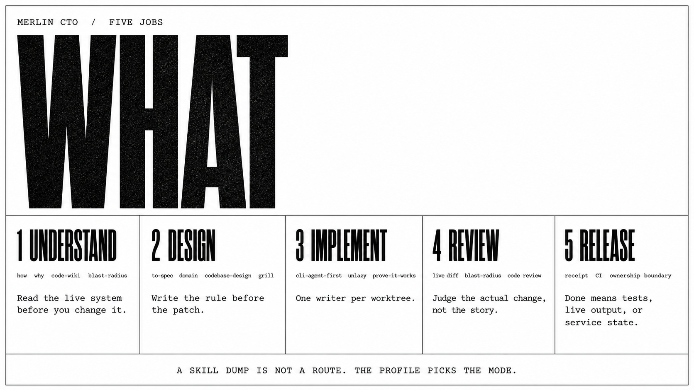
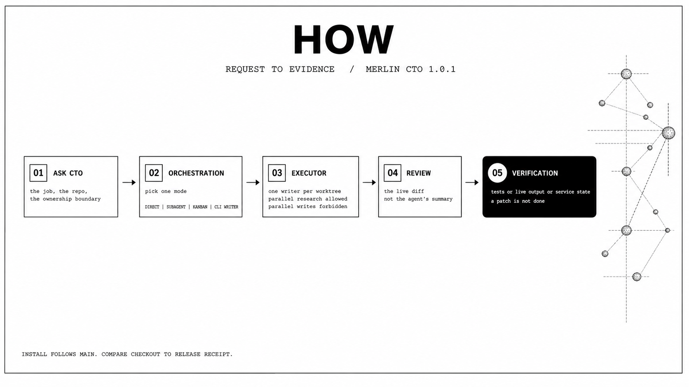
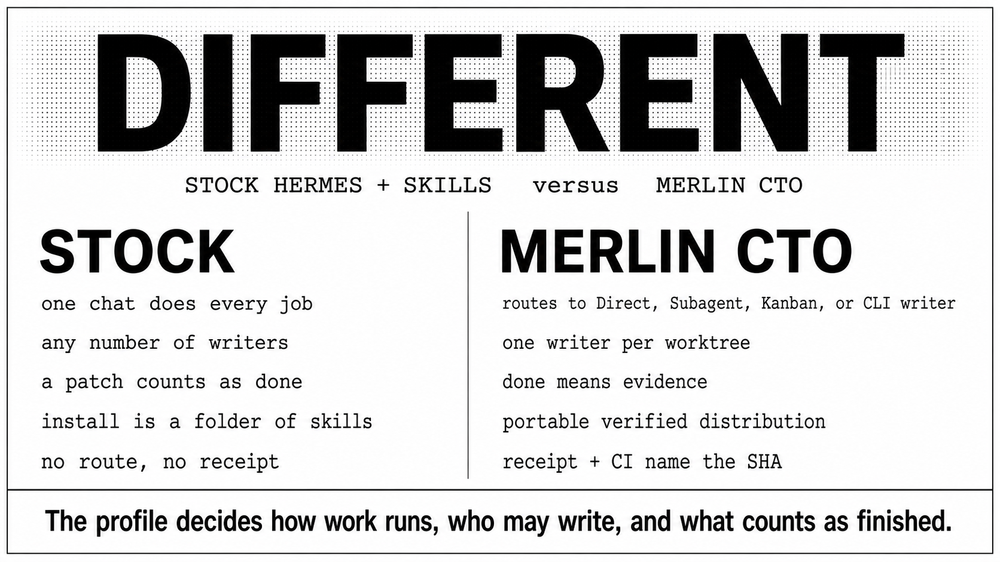

# Merlin CTO

<p align="center">
  
</p>

<p align="center">
  
</p>

An opinionated Hermes engineering profile. It routes architecture, implementation, review, release, and infrastructure work to the right execution mode, keeps one writer per worktree, and finishes with verification evidence.

Stock Hermes plus a skill folder still improvises the whole job in one chat and treats a patch as done. This profile decides how the work runs, who may write, and what counts as finished.

<p align="center">
  
</p>

[24-second reel](docs/media/reel.mp4). Same plates. Stations fill. The sun breathes.

Install from the [latest GitHub Release](https://github.com/merllinsbeard/merlin-CTO/releases/latest). `hermes profile install` follows `main`. Compare a checkout to that receipt.

<p align="center">
  
</p>

```bash
hermes profile install github.com/merllinsbeard/merlin-CTO --name merlin-cto --alias
```

```bash
hermes profile show merlin-cto
merlin-cto doctor
cd /path/to/repository
merlin-cto chat
```

If `gpt-5.6-sol` is unavailable on your Codex account:

```bash
hermes -p merlin-cto model
```

Credentials stay on the installing machine. They are never in this repository.

<p align="center">
  
</p>

<p align="center">
  
</p>

**Understand.** Map the live system before you change it. `how`, `why`, `code-wiki`, `blast-radius`.

**Design.** Lock the rule before the patch. `to-spec`, `domain-modeling`, `codebase-design`.

**Implement.** `cli-agent-first` picks direct, subagent, Kanban, or a coding CLI. One writer per worktree. Ask which skill or flow: `/ask-merlin`.

**Review.** Judge the live diff, not the story. `blast-radius`, `github-code-review`.

**Release.** Done means tests, live output, or service state. Shared repos stay local until the owner allows a push.

<p align="center">
  
</p>

<p align="center">
  
</p>

A real run from this repository, 2026-08-25.

**Ask.** After the first public publish: will every skill work for the person who installs this?

**Orchestration.** Stay on the distribution. Inventory every `related_skills` name against the materialized tree.

**Executor.** Add the six missing skills, retarget `sketch` to `prototype`, fail closed if a related skill is absent.

**Review.** Re-run the committed-tree verifiers on the pack itself.

**Verification.** `scripts/smoke_install.sh` installed 96 skills into a disposable profile and deleted it. Public commit: [`d6b0bbb`](https://github.com/merllinsbeard/merlin-CTO/commit/d6b0bbb5e27760612d409e5636212a475e767874).

A route that ends in "should work" is unfinished.

<p align="center">
  
</p>

<p align="center">
  
</p>

| Stock Hermes with extra skills | Merlin CTO |
| --- | --- |
| One chat does every job | Direct, subagent, Kanban, or a CLI writer |
| Any number of writers | One writer per worktree |
| A patch counts as done | Done means evidence |
| A folder of skills | A verified portable distribution |

`hermes profile install` clones the default branch with `git clone --depth 1`. Tag pinning is not honored yet. Treat the GitHub Release receipt as the version.

<details>
<summary>Compatibility, memory, and updates</summary>

Required: Hermes Agent 0.20.5 or newer, Git, and an authenticated `openai-codex` provider or another provider you set after install. Default model is `gpt-5.6-sol`.

Optional. Missing tools do not block install. The matching skill should say the tool is absent.

| Tool | Unlocks |
| --- | --- |
| `gh` | Issues, pull requests, reviews |
| Docker | Container work |
| Codex, Claude Code, or OpenCode CLIs | Writer skills already in the pack |
| Cursor Agent or Grok CLIs | Writers named in `SOUL.md`. No adapter skill ships here |
| `ast-grep` | Structural search |
| An image provider | Visualization skills |

Telegram is optional and needs a bot token you own:

```bash
hermes -p merlin-cto gateway setup
hermes -p merlin-cto gateway install
```

Memory is local Hermes memory. No OpenViking, `USER.md`, `MEMORY.md`, sessions, or project data ship in the pack. Each install starts empty.

```bash
hermes profile update merlin-cto
```

User-owned memory, sessions, credentials, and workspace data stay untouched.

</details>

<details>
<summary>Release history and skill provenance</summary>

| Version | Date | What landed |
| --- | --- | --- |
| [1.0.3](https://github.com/merllinsbeard/merlin-CTO/releases/tag/v1.0.3) | 2026-08-25 | `/ask-merlin` router and 107 skills |
| [1.0.2](https://github.com/merllinsbeard/merlin-CTO/releases/tag/v1.0.2) | 2026-08-25 | Positioning plates and a 24s reel |
| [1.0.1](https://github.com/merllinsbeard/merlin-CTO/releases/tag/v1.0.1) | 2026-08-25 | CI receipt no longer drops gitleaks into the checkout |
| [1.0.0](https://github.com/merllinsbeard/merlin-CTO/releases/tag/v1.0.0) | 2026-08-25 | First public distribution |

Full notes: [CHANGELOG.md](CHANGELOG.md).

```bash
python scripts/write_release_receipt.py --check /path/to/merlin-cto-1.0.3.receipt.json
```

Published commits are not GPG or SSH signed. No signing key is configured on the build host. Trust the receipt, the CI run on that SHA, and the GitHub Release asset.

107 `SKILL.md` files, materialized with no symlinks.

| Family | Count | Upstream |
| --- | --- | --- |
| `mattpocock/` | 22 | [mattpocock/skills](https://github.com/mattpocock/skills), MIT |
| `principle-*` | 11 | [pstack](https://github.com/cursor/plugins/tree/main/pstack), MIT |
| Visualization | 11 | Taste Skill, Baoyu, and distribution-authored adapters |
| GitHub, Hermes, and writer CLIs | 22 | Hermes Agent plus Codex, Claude Code, OpenCode adapters |
| Spec, review, debug, and campaign skills | 41 | This distribution and adapted Hermes engineering skills |

Third-party text keeps its own license. See [THIRD_PARTY_NOTICES.md](THIRD_PARTY_NOTICES.md).

</details>

<details>
<summary>Repository contents and verification</summary>

- `SOUL.md`: CTO behavior and operating rules
- `config.yaml`: portable default model, delegation, memory, and approval settings
- `skills/`: materialized engineering skills, no filesystem symlinks
- `distribution.yaml`: Hermes distribution manifest
- `scripts/`: publication, installation, and receipt checks
- `docs/media/`: public plates, section marks, and the short reel
- `.github/workflows/`: verifiers and gitleaks on every push

```bash
python scripts/verify_distribution.py .
python scripts/verify_public_tree.py .
gitleaks git --log-opts=-1 --no-banner --redact=100 .
scripts/smoke_install.sh
python scripts/write_release_receipt.py
```

A passing install proves packaging and loading. It does not prove your model authorization, Telegram, or a production deploy.

</details>

## License

Repository-authored files are MIT licensed. Bundled third-party skills keep their original licenses and attribution. See `THIRD_PARTY_NOTICES.md`.
