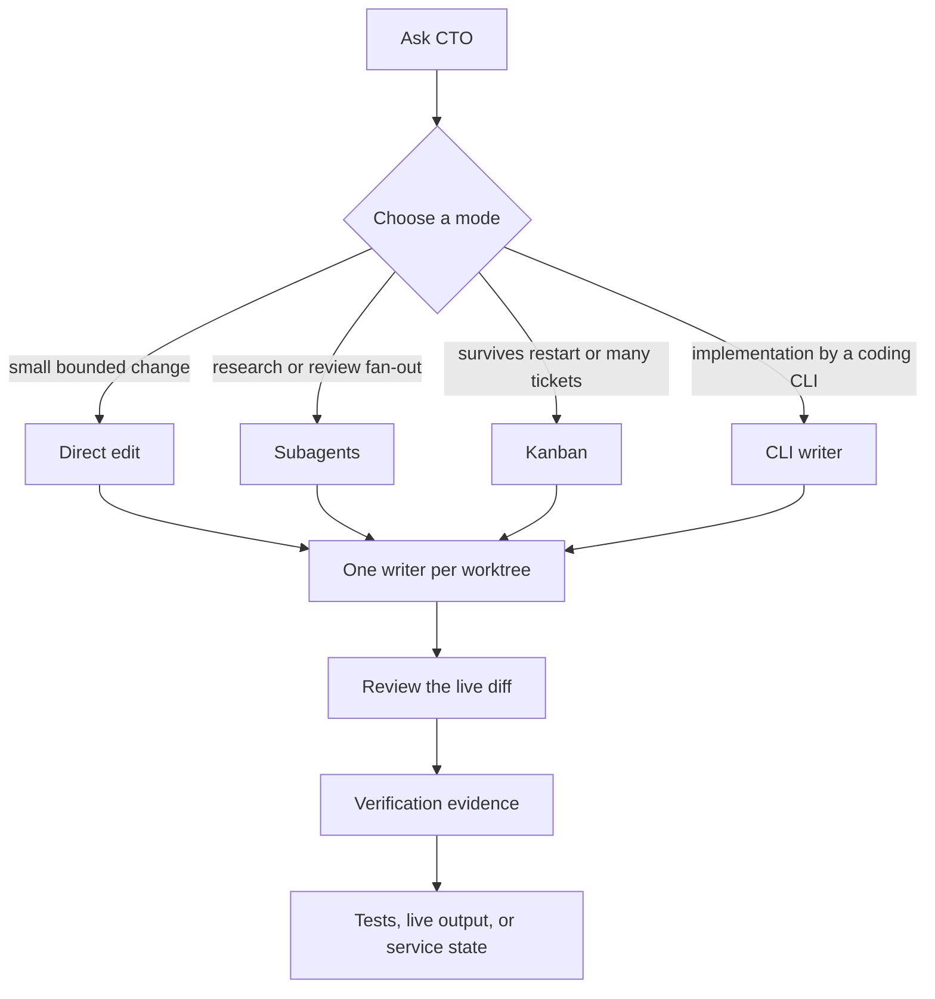

# Merlin CTO

Merlin CTO is an opinionated Hermes engineering profile that routes architecture, implementation, review, release, and infrastructure work to the right execution mode, enforces one writer per worktree, and finishes with direct verification evidence.

Stock Hermes plus a skill folder still improvises the whole job in one chat and treats a patch as done. This profile decides how the work runs, who may write, and what counts as finished.

Current distribution: **1.0.1**, 97 materialized skills, Hermes **0.20.5** or newer. Install follows the repository default branch. Compare a checkout to the [latest GitHub Release](https://github.com/merllinsbeard/merlin-CTO/releases/latest) before you trust it.

## What you use it for

### Understand

Map a codebase before you change it. `how` and `why` walk the live code, commits, and docs. `code-wiki`, `blast-radius`, and `codebase-capability-map` say what exists, what a change can break, and what the platform can actually do.

### Design

Lock the domain and the spec before writers start. `domain-modeling` and `codebase-design` make illegal states hard to express. `to-spec` and `to-tickets` turn that into a spec with acceptance checks and a ticket graph with `blocked_by`.

### Implement

Pick a mode with `cli-agent-first`: direct edit, subagent fan-out, Kanban, or a coding CLI. Hermes keeps the goal, the spec, and acceptance. One writer per worktree. `ponytail` picks the smallest change that works. `unlazy` and `principle-prove-it-works` refuse a stop at "I wrote the patch."

### Review

Review the live diff, the tests, and the neighboring paths, not a summary. `blast-radius` names the contracts. `github-code-review` and `requesting-code-review` run the review on the actual change. Depth follows risk, not a ritual number of passes.

### Release

Ship only what you can point at. `github-pr-workflow`, `github-repo-management`, and `production-release-verification` keep commit, push, merge, and production checks on evidence. Shared or client repos stay read-plus-local-diff until the owner says otherwise.

## One route, request to evidence

A real run from this repository, 2026-08-25.

**Ask.** After the first public publish: will every skill work for the person who installs this?

**Orchestration.** Stay on the distribution. Do not touch the installer person's machine. Inventory every `related_skills` name against the materialized tree.

**Executor.** Add the six missing skills, retarget `sketch` to `prototype`, and make `scripts/verify_distribution.py` fail if a related skill is absent.

**Review.** Re-run the committed-tree verifiers on the pack itself.

**Verification.** `scripts/smoke_install.sh` installed 96 skills into a disposable profile and deleted it. Public commit: [`d6b0bbb5e27760612d409e5636212a475e767874`](https://github.com/merllinsbeard/merlin-CTO/commit/d6b0bbb5e27760612d409e5636212a475e767874).

That is the bar. A route that ends in "should work" is unfinished.

## How a request moves




Orchestration is the profile, not a second product. The executor may be the CTO process itself or a writer CLI. Review reads the diff the writer left. Verification is a command, a URL, a test run, or a service state. Intention is not evidence.

## What makes it different

| Stock Hermes with extra skills | Merlin CTO |
| --- | --- |
| The chat does architecture, coding, and release in one pile | The profile picks direct, subagent, Kanban, or a coding CLI |
| Several writers can share one checkout | One writer per worktree. Parallel research is fine. Parallel writes are not |
| "Done" means the model wrote a patch | "Done" means tests, live output, a diff, a file, a URL, or service state |
| Git mutations follow whoever is logged in | Owned repos may go through the full cycle. Shared, client, and unclear repos stay local until you allow a push |
| Skills are a menu the model may ignore | Agent-facing text goes through `writing-for-agents`. Human answers go through `unslop` |
| Sharing a profile often means copying a home directory | This repo is a portable distribution: no memory, no sessions, no credentials, fail-closed verifiers |

## Install

```bash
hermes profile install github.com/merllinsbeard/merlin-CTO --name merlin-cto --alias
```

Inspect the installed profile:

```bash
hermes profile show merlin-cto
hermes profile info merlin-cto
merlin-cto doctor
```

Start it inside a project:

```bash
cd /path/to/repository
merlin-cto chat
```

If `gpt-5.6-sol` is unavailable on your Codex account, pick a model you can use:

```bash
hermes -p merlin-cto model
```

Provider credentials stay on the installing machine. They are never in this repository.

`hermes profile install` clones the default branch with `git clone --depth 1`. The module docstring mentions `#tag` pinning. The clone path does not honor it yet. Treat GitHub Releases and the receipt as the version. `hermes profile update merlin-cto` pulls that same default branch again.

## Compatibility and tools

Required for the core loop:

- Hermes Agent 0.20.5 or newer
- an authenticated `openai-codex` provider, or another provider you configure after install
- default model `gpt-5.6-sol`, or a substitute you select with `hermes -p merlin-cto model`
- Git

Optional. Missing tools do not block install. The matching skill should say the tool is absent instead of faking a result:

| Tool | Unlocks |
| --- | --- |
| `gh` | GitHub issues, pull requests, reviews |
| Docker | Container work |
| Codex, Claude Code, or OpenCode CLIs | Writer skills already in the pack |
| Cursor Agent or Grok CLIs | Writers named in `SOUL.md`. No adapter skill ships in this pack |
| `ast-grep` | Structural search |
| An image provider | Visualization skills |

Telegram is optional and needs a bot token you own:

```bash
hermes -p merlin-cto gateway setup
hermes -p merlin-cto gateway install
```

## Memory boundary

The distribution uses Hermes local memory. It does not include OpenViking, `USER.md`, `MEMORY.md`, sessions, databases, Telegram history, or project data.

Each install starts with an empty user and an empty memory. Do not reuse another person's memory namespace or credentials.

## Updating

```bash
hermes profile update merlin-cto
```

User-owned memory, sessions, credentials, logs, and local workspace data stay untouched.

## Release history and skill provenance

| Version | Date | What landed |
| --- | --- | --- |
| [1.0.1](https://github.com/merllinsbeard/merlin-CTO/releases/tag/v1.0.1) | 2026-08-25 | CI receipt step no longer drops the gitleaks binary into the checkout |
| [1.0.0](https://github.com/merllinsbeard/merlin-CTO/releases/tag/v1.0.0) | 2026-08-25 | First public distribution. 96 skills. Fail-closed verifiers. Isolated install smoke. Positioning README, changelog, and release receipts |

Full notes live in [CHANGELOG.md](CHANGELOG.md). Each GitHub Release attaches a receipt with commit SHA, tree SHA, skill count, and verifier results.

```bash
python scripts/write_release_receipt.py --check /path/to/merlin-cto-1.0.1.receipt.json
```

The first four commits on `main` are not GPG or SSH signed. No signing key is configured for this publisher on the build host. Do not rewrite that history. Trust the receipt, the CI run on that SHA, and the GitHub Release asset.

### Skill provenance

97 `SKILL.md` files, materialized with no symlinks.

| Family | Count | Upstream |
| --- | --- | --- |
| `mattpocock/` | 21 | [mattpocock/skills](https://github.com/mattpocock/skills), MIT |
| `principle-*` | 11 | [pstack](https://github.com/cursor/plugins/tree/main/pstack), MIT |
| Visualization | 11 | Taste Skill, Baoyu, and distribution-authored adapters |
| GitHub, Hermes, and writer CLIs | 15 | Hermes Agent plus Codex, Claude Code, OpenCode adapters |
| Spec, review, debug, and campaign skills | 39 | This distribution and adapted Hermes engineering skills |

Third-party text keeps its own license. See [THIRD_PARTY_NOTICES.md](THIRD_PARTY_NOTICES.md).

## Repository contents

- `SOUL.md`: CTO behavior and operating rules
- `config.yaml`: portable default model, delegation, memory, and approval settings
- `skills/`: materialized engineering skills, no filesystem symlinks
- `distribution.yaml`: Hermes distribution manifest
- `scripts/`: publication, installation, and receipt checks
- `tools/`: maintainer tooling
- `.github/workflows/`: verifiers and gitleaks on every push

## Verification

```bash
python scripts/verify_distribution.py .
python scripts/verify_public_tree.py .
gitleaks git --log-opts=-1 --no-banner --redact=100 .
scripts/smoke_install.sh
python scripts/write_release_receipt.py
```

A passing install proves packaging and loading. It does not prove your model authorization, Telegram, or a production deploy.

## License

Repository-authored files are MIT licensed. Bundled third-party skills keep their original licenses and attribution. See `THIRD_PARTY_NOTICES.md`.
